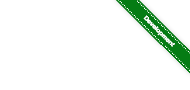

# dev-ribbon
Add a ribbon to your development sites

Add this tag to your HTML, and if the `window.location.hostname` matches `localhost`, `.dev` or `.local` it will show a green "Development" banner in the top right.

```
<script type="text/javascript" src="dev-ribbon.js"></script>
```

